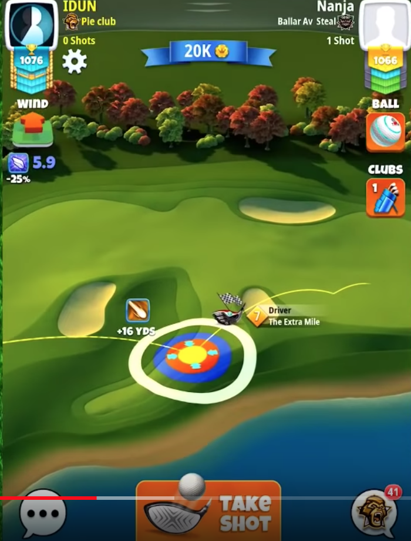
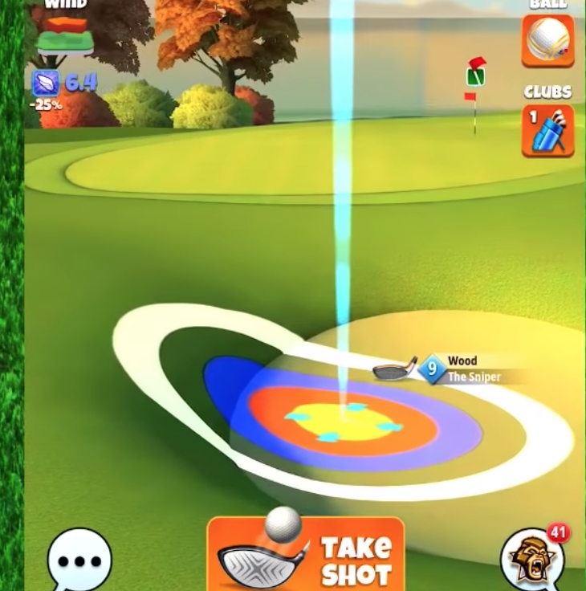

# Fuji Tournament

Infos à la volée prise en écoutant la vidéo suivante **pour le tournoi PRO**:
(https://www.youtube.com/watch?v=wAbSuf-_nrc)

> La vidéo pour le tournoi en rookie est [ici](https://www.youtube.com/watch?v=twjsZpStY8s)

Ce sont les infos de GC Tommy, ça ne m'engage pas et ce n'est pas nécessairement ce que j'ai fait.
> Mes remarques personnelles sont notées comme ceci.

## Trou 1 - Par 3
+ Sur ajuster la puissance de 20% (trou en descente)
+ Recommandé Bois Sniper et utilisation d'un **gros backspin** (minimum 5 bars)
+ Si Sniper ne supporte pas alors le Guardian est un bon choix.
+ Méthode 1 to 1 pour les anneaux.
> J'ai fait un Eagle en visant l'angle supérieur du bunker de droite avec du backspin et un vent fort (6.5) vers l'avant-gauche

## Trou 2 - Par 4
+ Trou en descente (10%)
+ Inutile de prendre une balle à Power 3, mais une balle avec beaucoup de Side effect. 2.5 Top Spin
+ Quarterback ou Extra Mile.
+ Jouer avec un peu de curl droite
+ L'approche Green est compliquée parceque le trou est au début du Green
+ Méthode, utilisation du dunk... avec du backspin **Très risquée**
+ **Le risque est de trop reculer**
+ Backspin max et dunk direct dans le trou.
> Je me contente du Birdie là

## Trou 3 -Par 5
+ Pas nécessaire d'utiliser une power 3 balle mais **Power 2**
+ Top spin max, l'objectif est d'avoir un 2ème rebond juste après la limite du second rough.

+ Max Side spin à gauche
> Si vous etes trop long après le 2ème rebond pas grave, le Green est atteignable depuis le rough.

+ L'approche est de rebondir sur le sable d'avant Green plutôt que sur le Rough qui n'est pas assez large

+ D'ajuster le top spin pour rouler jusqu'au trou
+ Albatross faisable avec **bcp de réussite**
+ Club recommendé: **Goliath** même pas

## Trou 4 - Par 4
+ Balle Power 3 (Titan) et sur ajuster de 10%

+ Pas nécessaire de Curl, Top Spin, un peu d'over Power
+ L'approche au Short Iron (Hornet ou Thorn)
+ Pas de sur ou sous ajustement
+ 3 bars de backspin

+ Rebond sur le Fairway, Eagle jouable

## Trou 5 - Par 3
+ Gros vent, balle avec -25% de vent mini.
+ Vent toujours de travers
+ Max Side spin. **Pas de CURL**
+ Le rebond se fait sur le bord gauche du bunker de gauche. On **perdra** de la distance avec ce rebond en pente et le side spin, sur ajustement de 2 anneaux.

> Ne pas être court, le Green a gauche est incliné et la balle se sauve. Préférer dépasser le trou qu'être court.

## Trou 6 - Par 5
+ Double rebond sur le fairway avant de passer le gap
+ 10% over ajustement, Pas trop d'over power **pour assurer le second rebond sur le fairway**
+ Max Top Spin (4,5 bars ou plus), un peu de Spin droit

> Attention de ne pas mordre le rough à droite au rebond et de ne pas être court lors du rebond.
> S'ouvrir l'angle à droite en s'éloignant des arbres un maximum.  

+ Approche au fer long. Albatros très dur parceque le fairway d'approche est très bosselé.

+ Viser le trou en roulant (Sniper et backspin, ou Goliath)

## Trou 7 - Par 3
+ Balle Navigator (-25%°) - 10% d'ajustement
+ Bois Sniper (3 bars backspin, 1 bar de spin droite)

+ Méthode 1 pour 1 au niveau des anneaux
+ L'objectif est d'avoir un guide de roulage le plus long possible pour aller jusqu'au trou (ne pas être court)

## Trou 8 - Par 4
+ Vent très facile à gérer, toujours un vent pour.

+ Balle Power 3 mais inutile d'aller au délà
+ Cible à droite de l'haut et over power
+ Max Top Spin pour rouler sur le rough et rouler jusqu'au second fairway.
+ Une alternative est de overpower à max, avec une balle power 5 et de rebondir derrère le bunker pour tenter de rouler au plus près du Green... **hautement improbable selon moi**
+ Approche au fer court (Thorn), sans spin (ni top ni back)
+ C'est un coup de mid range pour l'ajustement du Vent
+ Essayer de rouler jusqu'au Trou

## Trou 9 - Par 5
+ Club et balle avec de la distance (Titan)
+ Rebond à droite des arbres

> Je fais l'autre côté des arbres, à essayer...

+ L'approche au trou est un rough bump, ie. rebondir sur le rough d'avant Green et rouler jusqu'au trou.

+ S'assurer de viser légèrement à gauche du trou mais dans le trou. (10% d'ajustement au vent)
+ Albatross jouable.
